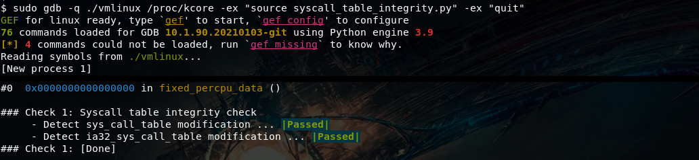
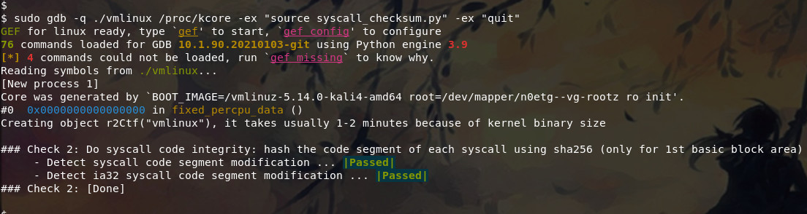
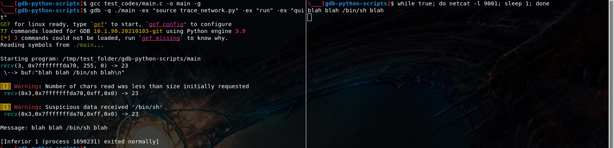

# gdb-python-scripts

This repo will contain gdb python scripts from scratch. The aim of the repo is to practice with the gdb python API.

## Contents ##

 - [syscall_table_integrity.py](syscall_table_integrity.py)
    * description: inspect syscall table and check its integrity
    * usage: `sudo gdb -q ./vmlinux /proc/kcore -ex "source syscall_table_integrity.py" -ex "quit"`

 

 - [syscall_checksum.py](syscall_checksum.py)
    * description: Compare syscall checksums of your kernel that is running with its vmlinux image ones. In particular, integrity of each syscall code segment using sha256 (only for 1st basic block area)
    * Before launching the script, download r2pipe module and place 'r2pipe' folder on the current folder, https://pypi.org/project/r2pipe/#files
    * I've also written an introduction to r2 and r2pipe here: https://tin-z.github.io/2020/10/11/solving-rev-1.html
    * usage: `sudo gdb -q ./vmlinux /proc/kcore -ex "source syscall_checksum.py" -ex "quit"`

 

 - [trace_network.py](trace_network.py)
    * description: trace network syscall and get alerts from suspicious packets flow (create your own alert rules)
    * usage: `gdb -q ./main -ex "source trace_network.py" -ex "run" -ex "quit"`

## Refs ##

 - [PythonGdbTutorial - GDB wiki](https://sourceware.org/gdb/wiki/PythonGdbTutorial)
 - [Python in GDB](https://lnxblog.github.io/2019/06/17/python-support-for-gdb.html)
 - [PythonGDB tutorial for reverse engineering - part 1](https://blog.lse.epita.fr//2012/05/01/pythongdb-tutorial-for-reverse-engineering-part.html)
 - 13. Breakpoints - tromey blog, http://tromey.com/blog/?p=698
 - [Simple GDB Extensions with Python](https://blog.0x972.info/?d=2016/01/08/09/14/47-simple-gdb-extensions-with-python)

